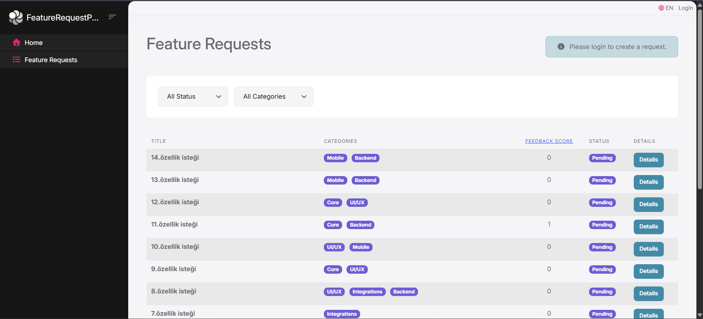
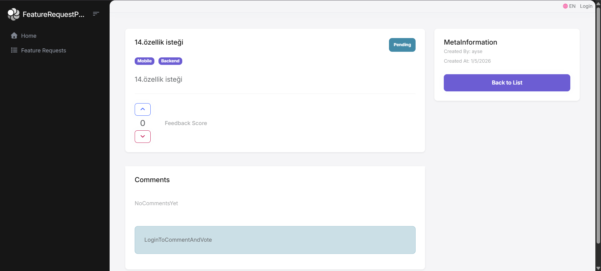
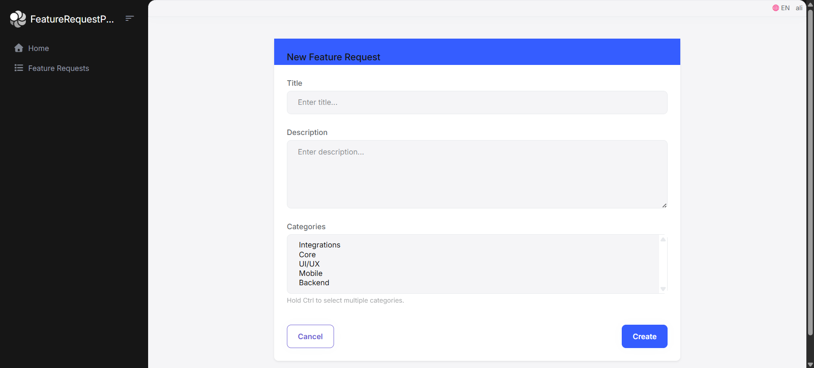

# Feature Request Portal

Bu proje, kullanıcıların (müşterilerin) yeni özellik taleplerini iletebildiği, bu talepleri oylayabildiği ve adminlerin süreci yönetebildiği bir portal uygulamasıdır.

### Örnek Senaryo
Bir araba firması, yeni modelinde hangi özelliklerin olmasını istediğini müşterilerine sorar (Örn: "Güneş panelli tavan", "Otonom sürüş asistanı"). Müşteriler en çok istedikleri özellikleri oylar, firma ise en yüksek oy alanları üretim planına dahil eder.

---

### Kurulum ve Çalıştırma

Projeyi yerel ortamınızda çalıştırmak için aşağıdaki adımları sırayla uygulayın:

#### Gereksinimler
*   **.NET 9.0+ SDK**
*   **Node.js v20.11+**
*   **ABP CLI:** `dotnet tool install -g Volo.Abp.Studio.Cli` (Yüklü değilse)
*   **PostgreSQL:** Veritabanı sunucusu olarak gereklidir.

#### Adım 1: Projeyi Klonlayın
Öncelikle projeyi bilgisayarınıza indirin:
```bash
git clone https://github.com/ayse-aktas/FeatureRequestPortal
cd FeatureRequestPortal
```

#### Adım 2: Bağımlılıkları Yükleyin (Client-Side)
Temel kütüphanelerin yüklendiğinden emin olmak için çözüm dizininde şu komutu çalıştırın:
```bash
abp install-libs
```

#### Adım 3: Veritabanı Hazırlığı (Migrations & Seed)
Veritabanı tablolarının oluşması ve başlangıç verilerinin (Admin yetkileri, Kategoriler) yüklenmesi için `DbMigrator` projesini çalıştırın:
```bash
cd src/FeatureRequestPortal.DbMigrator
dotnet run
```

#### Adım 4: Uygulamayı Başlatma
Veritabanı hazırlandıktan sonra ana web arayüzünü başlatın:
```bash
cd ../FeatureRequestPortal.Web
dotnet run
```
Uygulama ayağa kalktığında terminalde yazan adresten (genellikle `https://localhost:44359`) tarayıcı ile erişebilirsiniz.

---

### Ekran Görüntüleri
Burada uygulamanın temel işlevlerini adım adım görebilirsiniz:

*   **Ana Sayfa (Talep Listesi):** Tüm taleplerin listelendiği, oyların ve durumların görüldüğü ekran.
    
*   **Talep Detay ve Oylama:** Bir talebin içine girildiğinde oylama ve yorum yapma alanı.
    
*   **Yeni Talep Oluşturma:** Kullanıcıların yeni bir fikir ilettiği form.
    
*   **Admin Paneli (Durum Güncelleme):** Adminlerin talebi "Onaylandı" veya "Planlandı" gibi statülere çektiği alan.
    

---

### Mimari Yapı ve Varsayımlar
Proje, ABP Framework standartlarına uygun olarak Domain Driven Design (DDD) mimarisiyle geliştirilmiştir:

*   **Katmanlı Mimari:** Domain, Application, Web ve EntityFrameworkCore katmanları birbirinden izole edilmiştir.
*   **Entity Yapısı:** `FeatureRequest` ana entity (AggregateRoot), `Vote` ve `Comment` ise ona bağlı çocuk (Child) entity’ler olarak kurgulanmıştır.
*   **Oylama Mantığı:** +1/-1 bir model uygulanmıştır. Bir kullanıcı her talebe sadece bir kez oy verebilir.
*   **Yetkilendirme:** ABP'nin yerleşik Permission sistemi kullanılarak Admin ve Normal Kullanıcı yetkileri ayrılmıştır.
*   **Kategoriler:** Taleplerin birden fazla kategoriye sahip olabileceği (Many-to-Many) varsayılarak dinamik bir filtreleme yapısı kurulmuştur.

---

### Zorlandığım Noktalar
*   **ABP Modüler Yapısı:** Projenin çok fazla katmana bölünmüş olması başlangıçta sorumlulukları ayırt etmemi zorlaştırdı. Hangi kodun hangi projede (Domain mi, Application mı?) olması gerektiğini dokümanları ve örnekleri inceleyerek kavradım.
*   **MVC Controller Kısalığı:** Alışık olduğum MVC yapısında Controller'lar daha kalabalıktır. ABP'de iş mantığının AppService katmanına aktarılması ve Controller'ın sadece AbpControllerBase'den kalıtım alarak bu kadar sadeleşmesi başta kafa karıştırıcı olsa da sonradan çok mantıklı geldi.
*   **Yetki Yönetimi:** PermissionDefinitionProvider ve DataSeed mantığını kullanarak veritabanı seviyesinde otomatik yetki atamayı kurgulamak öğretici bir süreçti.

---

### Öğrendiklerim
*   **Profesyonel Proje Yapısı:** Kurumsal seviyede bir projenin nasıl katmanlara ayrıldığını ve bağımlılıkların (Dependency Injection) nasıl yönetildiğini öğrendim.

*   **ABP Framework Standartları:** Localization, Soft-Delete ve Audit Logging gibi yerleşik yetenekleri kullanarak, kurumsal bir framework'ün sunduğu hazır çözümlerle geliştirme süreçlerini optimize etmeyi ve standartlara uyum sağlamayı öğrendim.

*   **EF Core Mapping:** Fluent API kullanarak karmaşık veritabanı ilişkilerini (M-to-M, 1-to-N) ABP standartlarında tanımlamayı öğrendim.

*   **Temiz Kod (Clean Code):** İş mantığını Controller'dan ayırıp Service katmanına taşımanın kodun okunabilirliğini ne kadar artırdığını gördüm.